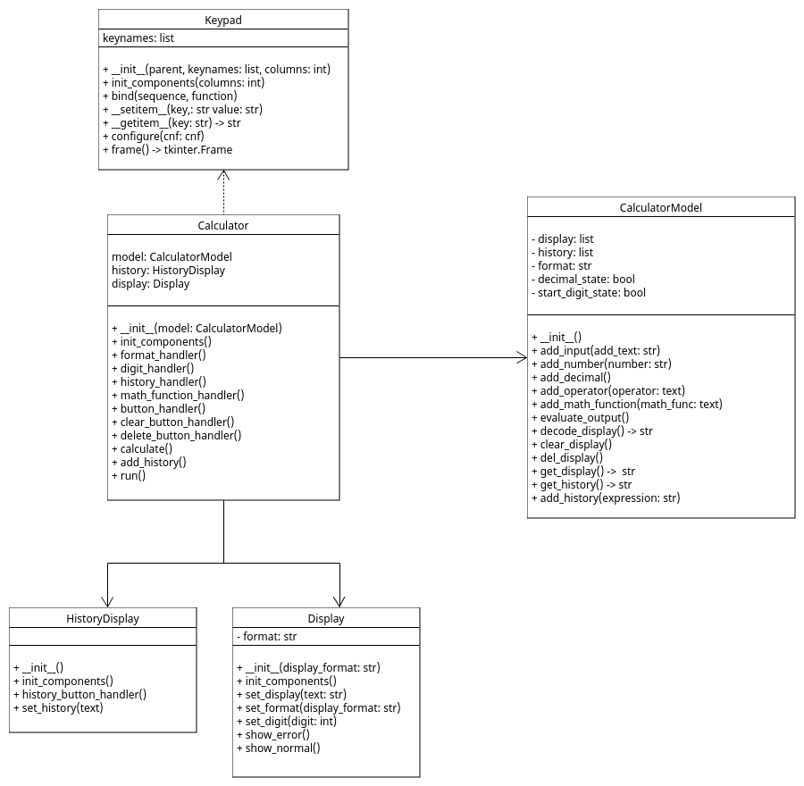

# calculator

A Calculator using Python Tkinter graphics.

| file                  | Description                                                  |
|-----------------------|--------------------------------------------------------------|
| calculator_app.py     | The Calculator class for user interface.                     |
| calculator_display.py | The Calculator view class display the data to user           |
| calculator_model.py   | The CalculatorModel class contain data and logic for calculator |
| keypad.py             | Keypad Class                                                 |
| main.py               | main block to run the program.     

### UML Diagram
